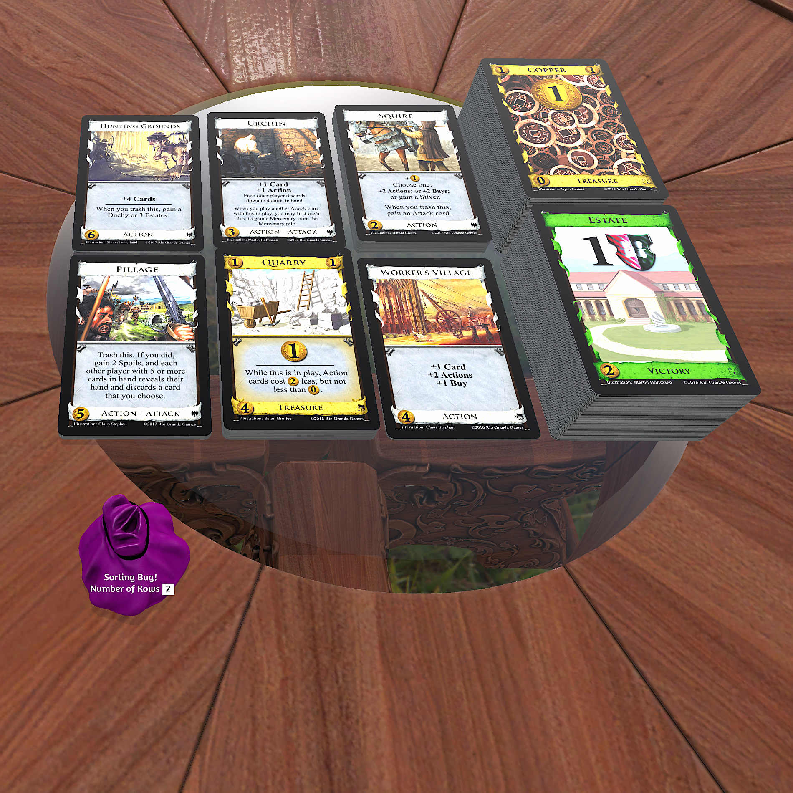

# Multi Sorting Bag

Sorting tool for cards, decks, or general detritus.
* Customizable number of sorted rows
* Just drop anything in the bag, it'll sort it. Supports cards, decks, recursive bags, etc.
* Sorted objects will be placed on the table above and to the right of the bag, oriented with text facing you.
* Supports large number of sorted objects (tested with hundreds of cards)
* Snappy performance
* Bags placed into the sorter will be deleted once their contents are sorted onto the table
